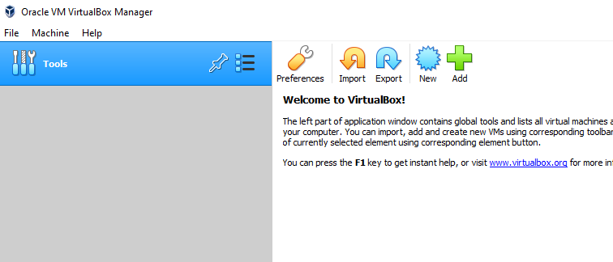

# WINISIS-Exporter

Migrating CDS/WINISIS Databases into JSON Format

[](https://doi.org/10.5281/zenodo.6778672)

## 1. About

Mini-Micro CDS/ISIS was a bibliographic database system developed and used in the late 1980’s by UNESCO. It holds data in a flat-file structure using separators, as well as field mappings in an additional files and can be run in a DOSBox emulator.

The goal of this project is to extract and migrate the data from Mini-Micro CDS/ISIS into a modern data representation. As input, we received the full software (WinISIS), as well as the database files for the "BIBLIO" database with additional formattings as .PFT files. 

The data can successfully be transformed into JSON representation by utlizing the WinISIS software to print the data in a specific format, which can be generated from the database's FDT (Field Definition Table) file. The ouput is then further processed into a json document with the provided pyton code. 
The installation and execution of the procedure is described below. 

## 2. **How to Install and Run the Project**

Following software is needed to fully run this project:

- VirtualBox
- WinISIS
- Python3

### 2.1 Virtual Box

Download the VirtualBox Installer for your environment from [https://www.virtualbox.org/wiki/Downloads](https://www.virtualbox.org/wiki/Downloads) and install it.

<aside>
📃 This project was run with VirtualBox Version 6.1.34 r150636 (Qt5.6.2)

</aside>

### 2.2 WinISIS

In this project we are using a Windows Installation of CDS/ISIS called WinISIS in version 1.4 (build 19).
More information can be found under [https://en.wikipedia.org/wiki/CDS_ISIS](https://en.wikipedia.org/wiki/CDS_ISIS).

<aside>
⚠ Sources cannot be provided within the scope of this project. 
</aside>


### 2.3 Python 3

Download the Python 3 Installer from [https://www.python.org/downloads/](https://www.python.org/downloads/) and install it on your machine. To verify what version of python is running on your machine use the following command: 

```bash
> py --version
Python 3.9.5
```

<aside>
⚠️ You may have multiple python versions installed, which are called by different aliases. You may also use python or python3 instead of py. 
**A version 3.X.X is needed.**

</aside>

No additional libraries have to be installed, the project uses only three python base libraries: re, json and argparse. 

### 2.4 WINISIS-Exporter

1. Clone the repository from [https://github.com/kooperativ97/winisis-exporter](https://github.com/kooperativ97/winisis-exporter)
2. Execute the WinISIS Datenbankexport (See Chapter 3)
3. Run export.py (See chapter 4.2)

## 3. WinISIS Datenbankexport

### 3.1 Installing Windows XP

Download the ZIP Archive from [https://archive.org/details/xp51_20191108](https://archive.org/details/xp51_20191108)[.](https://archive.org/details/win_me_archive_vdi) It contains a VirtualBox volume with a Windows XP installation. Copy the contained .vdi file into a directory of your choice, where VirtualBox has access to it. 

**Creating a Machine**

Open VirtualBox and create a new machine by clicking on the `New` button. 



Give a telling name, set the Machine Folder, Type and Version to Microsoft Windows XP, set the Memory size to 512 MB and finally add the Windows XP vdi as Hard Disk.


Further set the Processors to 2, The Video Memory to 128 MB and activate 3D Acceleration. This step is important, so the Virtual Box Guest Additions can be installed. 

Start the Virtual Machine and wait for the machine to boot up. Then proceed to install the VirutalBox Guest Additions by choosing Devices → Insert Guest Additions CD image…


An installation wizard should pop up which guides you through the installation. The default settings for the destination folder:  “C:\Program Files\Oracle\VirtualBox Guest Additions” should work fine

<aside>
⚠️ If the wizard does not open automatically. Open “My Computer” and navigate to the “Devices with Removable Storage” and double click it.

</aside>

The installation should take only several seconds. Afterwards, restart the machine. 

**Adding Shared Folders** 

To get data in and out of our virtual machine, we will configure shared folders. Therefore right-click the folder icon on the bottom right of your virtual machine window and select “Shared Folder Settings”.


Add a folder of your choice. In this case it is the folder transfer, inside my hosts download folder and activate “Auto-mount”. 

You then should see a mounted Network Drive inside your File Explorer in the virtual machine.


## 3.2 Running WinISIS

First copy the WinISIS installation files into the hosts transfer folder and switch to the virtual machine. The default directory is `\WINISIS`, therefore create a folder named “WINISIS” in C:\ and copy the files into it: 


When you now try to start the program by launching `WISIS.exe` an error message will occur, stating that `CTL3D.DLL` is missing. 


**ctl3d.dll** 

The needed ctl3d.dll was downloadable through UNESCO via the following (now inactive) link: [http://www.unesco.org/isis/files/winisis/windows/CTL3D/CTL3D.DLL/](http://www.unesco.org/isis/files/winisis/windows/CTL3D/CTL3D.DLL/)

With the help of the WayBackMachine, you can find a snapshot of the page from 2007, where the dll is still downloadble: 

[https://web.archive.org/web/20070513120648/http://www.unesco.org/isis/files/winisis/windows/CTL3D/CTL3D.DLL/](https://web.archive.org/web/20070513120648/http://www.unesco.org/isis/files/winisis/windows/CTL3D/CTL3D.DLL/)

Download the dll as `ctl3d.dll` and save it into the transfer folder and then transfer it into the virtual machines `C:\Windows` folder. 

Now, when starting the program, the CDS/ISIS for Windows windows should appear.


Now copy the Data you want to explore into the virtual machine. 

<aside>
⚠️ Do not try to access the data directly from the network drive, WINISIS will not be able to read the data. Copy it onto the C: drive and work from there.

</aside>

## 3.3 Export Data Using The Printer Workaround

The CDS/ISIS Database does not export the broken BIBLIO.MST file correctly. It always reaches a point where the program crashes with an error. The database viewer on the other hand can view all the elements in any given format (as long as it is syntactically correct). 

First open the BIBLIO.MST Database 


Open the BIBLIO.MST File in the Database

Then create a PFT file with the following content in the same folder where the BIBLIO.MST file is. 

```java
"###v1: "v1"|||","v20: "v20"|||","v22: "v22"|||","v23: "v23"|||","v31: "v31"|||","v40: "v40"|||","v50: "v50"|||","v60: "v60"|||","v70: "v70"|||","v87: "v87"|||","v88: "v88"|||","v89: "v89"|||","v100: "v100"|||","v101: "v101"|||","v121: "v121"|||","v122: "v122"|||","v123: "v123"|||","v124: "v124"|||","v201: "v201"|||","v202: "v202"|||","v203: "v203"|||","v204: "v204"|||","v211: "v211"|||","v212: "v212"|||","v213: "v213"|||","v214: "v214"|||","v231: "v231"|||","v232: "v232"|||","v233: "v233"|||","v234: "v234"|||","v251: "v251"|||","v252: "v252"|||","v253: "v253"|||","v254: "v254"|||","v262: "v262"|||","v263: "v263"|||","v300: "v300"|||","v301: "v301"|||","v302: "v302"|||","v303: "v303"|||","v305: "v305"|||","v306: "v306"|||","v307: "v307"|||","v310: "v310"|||","v312: "v312"|||","v313: "v313"|||","v314: "v314"|||","v315: "v315"|||","v316: "v316"|||","v317: "v317"|||","v318: "v318"|||","v320: "v320"|||","v321: "v321"|||","v322: "v322"|||","v323: "v323"|||","v324: "v324"|||","v402: "v402"|||","v404: "v404"|||","v442: "v442"|||","v443: "v443"|||","v444: "v444"|||","v462: "v462"|||","v463: "v463"|||","v464: "v464"|||","v490: "v490"|||","v500: "v500"|||","v550: "v550"|||","v600: "v600"|||","v610: "v610"|||","v620: "v620"|||","v621: "v621"|||","v622: "v622"|||","v623: "v623"|||","v624: "v624"|||","v625: "v625"|||","v626: "v626"|||","v630: "v630"|||","v800: "v800"|||","v801: "v801"|||","v810: "v810"|||","v820: "v820"|||","v830: "v830"|||","v831: "v831"|||","v832: "v832"|||","v833: "v833"|||","v834: "v834"|||","v835: "v835"|||","v836: "v836"|||","v840: "v840"|||","v850: "v850"|||","v852: "v852"|||"
```

This file was generated from the BIBLIO.FDT file and contains all possible fields delimited by `|||` and entries delimited by `###`. **To generate this file go to Section 4.1**

<aside>
⚠️ Sometimes, the database does not recognize new PFT files, in this case, either edit the content of an already existing PFT file.

</aside>

Then select Database → Print and edit the configuration so that: 

- It prints the whole database by selecting Print What → Current Browse Set
- It prints to an ASCII Printer by selecting Output To → ASCII File (Windows-ANSI)
- It uses the the custom PFT as format by selecting Print Format → RAK
    - The predefined format from the file should be displayed in the textbox below
    - Alternatively, uncheck Pre-defined Format and paste the PFT into the Print Format text box.

If the above settings are configured click on `Print`:


 Finally select a file where the data should be printed to, in this case `export.txt`c


Exporting dialog, takes about 60 seconds to finish

After the export has finished, there should be the file `export.txt` on the configured location with all the entries exported. Copy the exported file into the configured transfer folder (or Network Share). 

From the transfer folder, copy the `export.txt` into the cloned repository under `winsis_prints/export.txt`

<aside>
ℹ️ The export of BIBLIO.MST is  8 640 163 bytes in size.

</aside>

# 4. Run export.py

To run the [export.py](http://export.py) you have to put the database files into the `data` folder of the project. 
(For the export.py only the .FDT file is needed) 

## 4.1 Create the custom PFT

To create the custom PFT from the database’s FDT file, navigate to the root of the cloned repository and open a terminal and execute the command below.

```bash
> py export.py -g pft -fdt data/BIBLIO.FDT -o winsis_prints/RAK.PFT
```

This will use the `data/BIBLIO.FDT` file to generate the PFT into `winisis_prints/RAK.PFT`

<aside>
➡️ This file is needed to export the data from the WINISIS database with all available data fields. See Section 3.3

</aside>

## 4.2 Convert the export to JSON

To convert the exported data into JSON format, navigate to the root of the cloned repository and open a terminal and execute the command below.

```bash
> py export.py -g json -fdt data/BIBLIO.FDT -epf winsis_prints/export.txt -o export.json
```

This will use the `data/BIBLIO.FDT` file in combination with `winisis_prints/export.txt` (from Section 3) to generate the JSON into `export.json`.

## 5. Results

The final result of this project is a JSON file in ANSI encoding. In case of the BIBLIO.MST export, run in this project, the final JSON has a size of 16 395 492 bytes. 

It is structured as an array of objects, where each object represents one data entry of the database. Each entry has the data fields as keys, and their value in string representation. Subfields are preserved by nesting values inside another object structure, with the subfield letter as key.

```json
{
	"Urheber Datensatz (INSTITUT)": {
		"a": "ATRIGP",
		"b": "I",
		"c": "1996"
	},
	"Datensatzeingabe (DATUM)": "19910511",
	"Datensatzkennung (CODE)": "M",
	"Originaltitel Monographie": {
		"a": "Hat Kultur Vergangenheit ?"
	},
	"Erscheinungsjahr Monographie": {
		"a": "1965"
	},
	"Physische Beschreibung Monogr.": {
		"b": "zahlr. Ill"
	},
	"Exemplaranzahl": "01",
	"Exemplarstatus": {
		"a": "präsent"
	}
}
```

## 6. Authors

Tobias Hajszan ([orcid.org/0000-0002-7143-0353](https://orcid.org/0000-0002-7143-0353))

Maryna Gutruf ([orcid.org/0000-0002-2953-0844](https://orcid.org/0000-0002-2953-0844))
